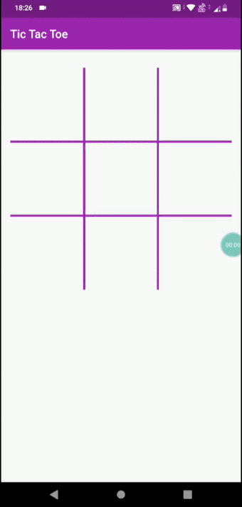

# Tic-Tac-Toe

Unbeatable Tic-Tac-Toe built using Minimax Algorithm with Flutter. [View it Online](https://saurabhmittal16.github.io/tic-tac-toe/)

Resources: [1](http://theoryofprogramming.com/2017/12/12/minimax-algorithm/) [2](https://www.quora.com/Is-there-a-simple-explanation-of-a-minimax-algorithm/answer/Glenn-Rhoads)
